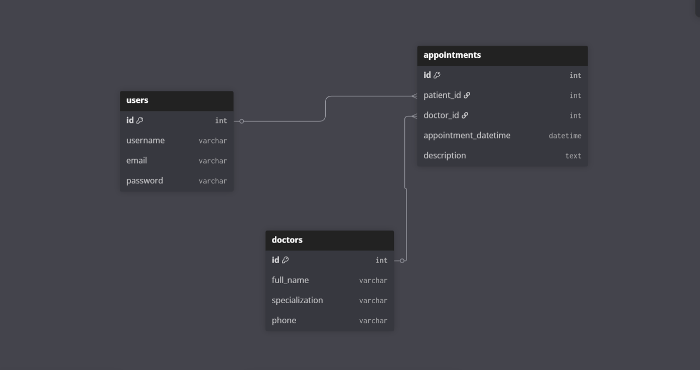

# Hospital Appointment Management System

## Project Description

This is a web-based **Hospital Appointment Management System** built using Django.  

The system allows patients to register, log in, and schedule appointments. The **admin** oversees the entire system.  

The system is designed to simplify appointment booking, reduce administrative workload, and provide an organized view of upcoming appointments. 

---

## Getting Started

● To explore the Hospital Appointment App:

---

## ERD



---

## Installation & Setup

● **Clone the Repository**

```bash
git clone https://github.com/Tamara-dw/Capstone-Project.git
cd Capstone-Project
```
● **Create & Activate Virtual Environment**
```
pipenv shell
```
● **Setup PostgreSQL Database**
```
CREATE DATABASE hospital_db;
CREATE USER hospital_user WITH PASSWORD 'yourpassword';
GRANT ALL PRIVILEGES ON DATABASE hospital_db TO hospital_user;
```
● **Update settings.py**
```
DATABASES = {
    'default': {
        'ENGINE': 'django.db.backends.postgresql',
        'NAME': 'hospital_db',
        'USER': 'hospital_user',
        'PASSWORD': 'yourpassword',
        'HOST': 'localhost',
        'PORT': '5432',
    }
}
```
● **Apply Migrations**
```
python manage.py makemigrations
python manage.py migrate
```
● **Create Superuser**
```
python manage.py createsuperuser
```
● **Run the Server**
```
python manage.py runserver

```
● **Visit:**
```
Main site: http://127.0.0.1:8000/

Admin panel: http://127.0.0.1:8000/admin/
```

# User Stories
● **Patient**

  ● Can register and log in to the system.

  ● Can view available doctors and schedule appointments.

  ● Can add, edit, or cancel their own appointments.

● **Admin**

  ● Can manage doctors, patients, and appointments.
  
  ● Can view all system data via the Django Admin Panel.

  ● Has full CRUD control over all entities.

# Key Features
✅ Patient registration and login

✅ Appointment creation, editing, and deletion

✅ Dashboard to view upcoming appointments (sorted by date)

# Challenges & Solutions
 ● Displaying appointments in chronological order Used order_by('appointment_datetime') in DashboardView

 ● Keeping user-specific appointments only Filtered appointments by patient=self.request.user in the views

# Future Improvements
 ● Allow doctors to have their own login and manage their schedules.

 ● Add email notifications for upcoming appointments.

 ● Enhance the CSS of the pages